# AssetFlow — Enterprise Asset & Resource Management System

**AssetFlow** is a lightweight, modern, and operationally focused ERP module designed to digitize how organizations track, allocate, maintain, and audit physical assets and shared resources. It replaces spreadsheets and manual tracking with a robust relational database, conflict-free scheduling, state-machine-driven lifecycles, and real-time visibility.

---

## 🌟 Key Features

1. **Light Mode UI & Modern Layout:** A clean, tailored, high-contrast light theme with a collapsible sidebar, responsive layouts, empty states, and dynamic loaders.
2. **Interactive Dashboard:** Surfacing live KPI counts (Available, Allocated, Maintenance, Active Bookings) with overdue allocations tracked in high-priority visual states. Real-time updates delivered via SSE.
3. **Asset Registry & Details:** Full search, sorting, filtering, sequential tag generation, QR code rendering, and exhaustive timeline history tabs (Allocations, Maintenance, Bookings).
4. **Allocation & Transfer:** Double-allocation prevention using raw database transaction locks, return processing with condition notes, and an automatic **Transfer Request** workflow.
5. **Resource Booking:** A fully custom 7-day week calendar grid (built without external calendar libraries) that rejects overlapping bookings with precise hourly conflicts highlighted.
6. **Kanban Maintenance Board:** A 6-column workflow (Pending → Approved → Assigned → In Progress → Resolved → Rejected) mapping status transitions, technician assignments, and return handbacks.
7. **Scoped Audit Cycles:** Scoping cycle assets, audit checklists (Verified / Missing / Damaged), automatic calculated discrepancy reports, and locked closure state updates.
8. **Security & RBAC Matrix:** Strict division between four user roles: **Admin**, **Asset Manager**, **Department Head**, and **Employee** (Signup defaulting to Employee).
9. **Account Settings & Preferences:** Dynamic user profile options with a password strength meter, show/hide credentials toggle, and granular notification preferences.

---

## 📸 Screenshots

| | |
|---|---|
| **Login** | **Dashboard** |
| 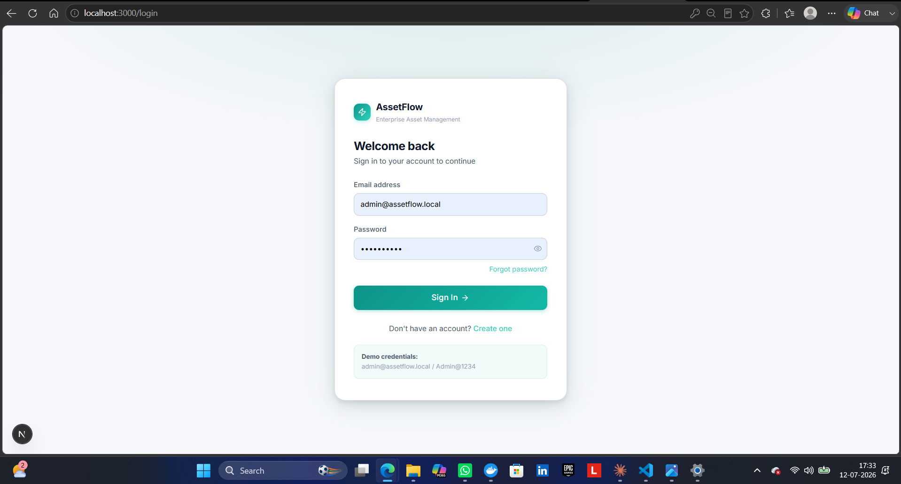 | 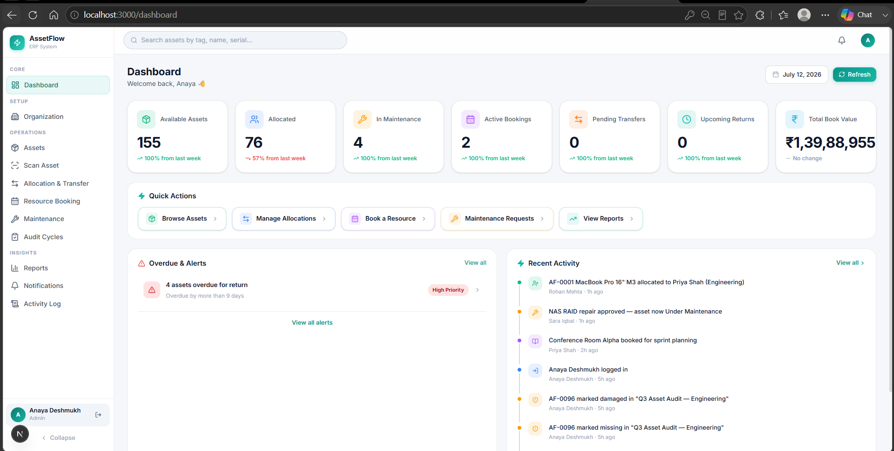 |
| **Organization Setup** | **Asset Directory** |
| 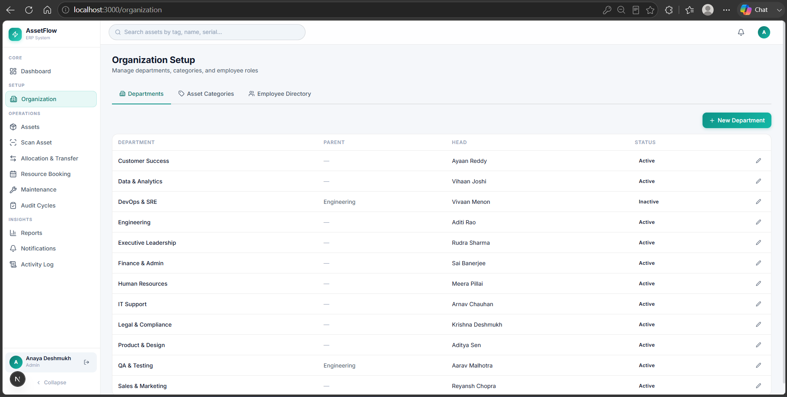 | 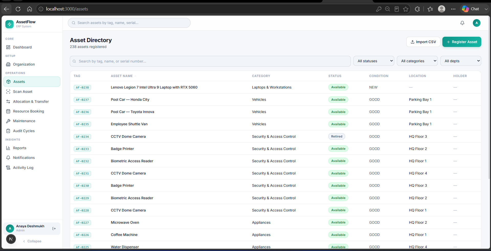 |
| **Allocation & Transfer** | **Resource Booking** |
| 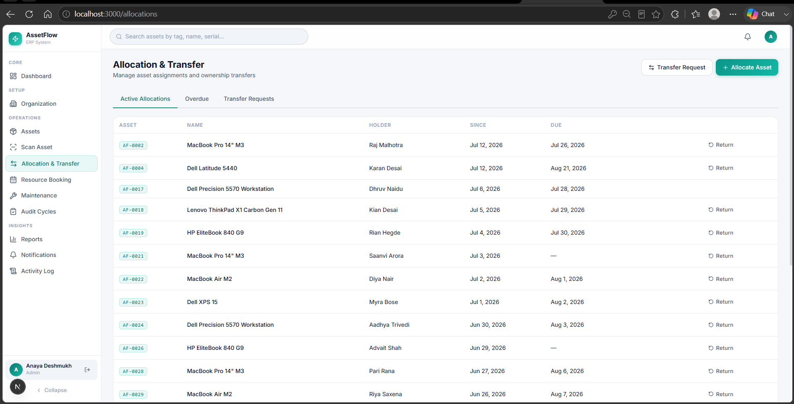 | 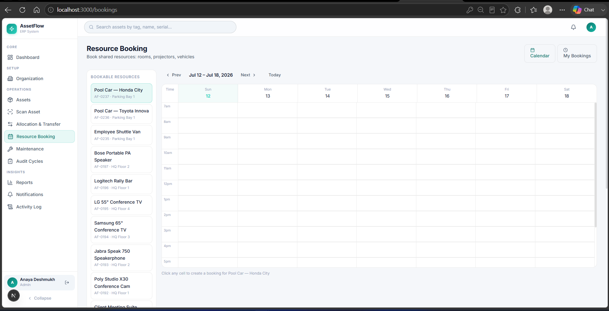 |
| **Maintenance Kanban** | **Audit Cycles** |
| 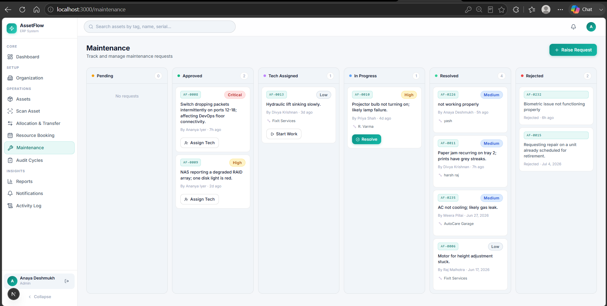 | 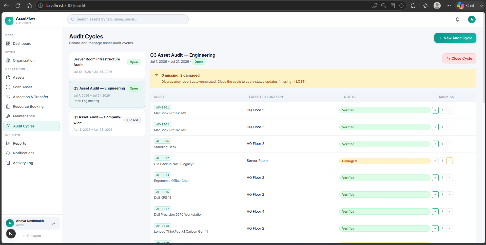 |
| **Reports & Analytics** | **Activity Log** |
| 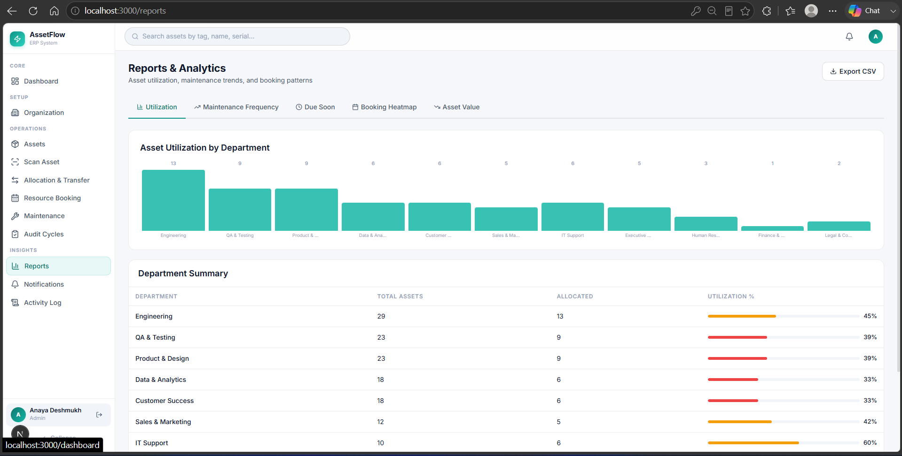 | 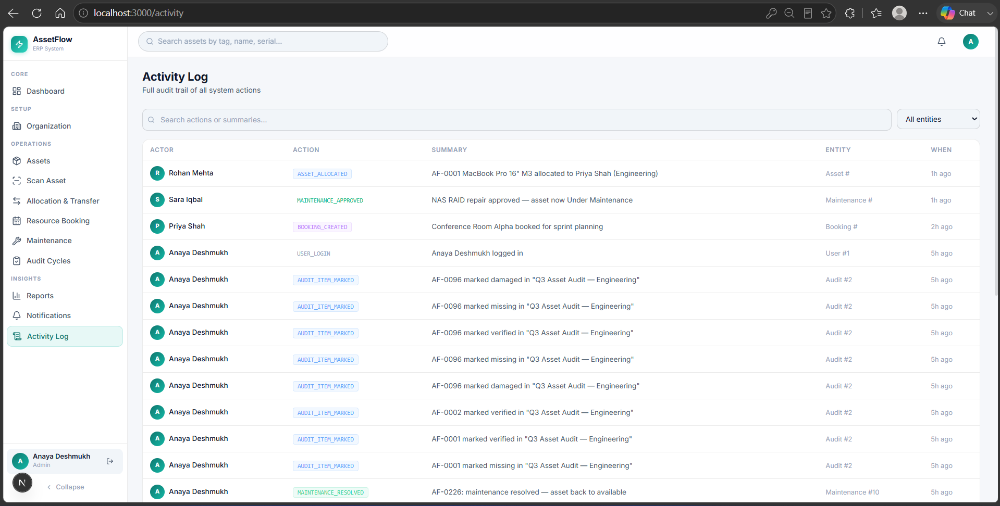 |
| **Notifications** | |
| 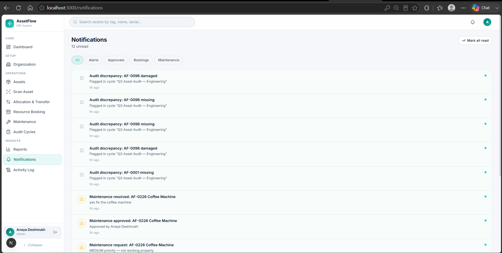 | |

---

## 🛠️ Technology Stack

- **Frontend:** Next.js 16 (App Router / Turbopack), React 19, Vanilla CSS (Design tokens & globals)
- **Backend:** Node.js, Express (ES Modules), Zod validations, JSON Response envelope
- **Database:** MySQL 8 running locally (`mysql2` pool, custom raw SQL migration runner)
- **Real-Time Integration:** Server-Sent Events (SSE) for system-wide dashboard invalidation and push notifications
- **Scheduler:** Lightweight in-process setInterval-based scheduler ticking every 60s for overdue flagging, status transitions, and booking notifications

---

## ⚙️ Setup & Installation

### 1. Prerequisites
- **Node.js** (v20+)
- **MySQL Server** running locally on port 3306

### 2. Configure Environment Variables
Bring up MySQL via Docker from the repo root (`docker compose up -d mysql`), or point at your own
server. Either way, create a `.env` file in the `/backend` directory (copy `.env.example`) and
configure your MySQL credentials:
```env
PORT=4000
DB_HOST=127.0.0.1
DB_PORT=3306
DB_USER=root
DB_PASS=your_mysql_password
DB_NAME=assetflow
JWT_SECRET=your_jwt_secret_key
CLIENT_ORIGIN=http://localhost:3000
```

### 3. Database Setup (Migrations & Seeding)
Navigate to the backend directory, install dependencies, compile migrations, and seed the demo data:
```bash
cd backend
npm install
npm run db:migrate
npm run db:seed
```

---

## 📁 Project Structure

```
odoo-assetflow-erp/
├── backend/
│   ├── src/
│   │   ├── modules/         # activity, allocations, assets, audits, auth,
│   │   │                     # bookings, dashboard, maintenance, notifications,
│   │   │                     # org, reports, transfers (routes + SQL per domain)
│   │   ├── db/               # migrate.js, seed.js, migrations, pool config
│   │   ├── jobs/              # cron-style scheduler (overdue flags, notifications)
│   │   ├── middleware/       # auth guard, error handler, multer uploads
│   │   ├── config.js
│   │   └── index.js
│   └── package.json
├── frontend/
│   ├── src/
│   │   ├── app/
│   │   │   ├── (auth)/        # login, signup, forgot/reset password
│   │   │   └── (app)/         # dashboard, assets, allocations, bookings,
│   │   │                       # maintenance, audits, reports, notifications,
│   │   │                       # activity, organization, settings
│   │   └── lib/               # api client, sse.ts, auth helpers
│   └── package.json
├── docs/
│   ├── screenshots/           # README images
│   └── MANUAL_TEST_DATA.md    # copy-paste test data for every module
├── docker-compose.yml         # mysql service
└── README.md
```

---

## 🚀 Running the System

Start both servers in two separate terminal shells:

### Terminal 1: Run Express Backend (Port 4000)
```bash
cd backend
npm run dev
```

### Terminal 2: Run Next.js Frontend (Port 3000)
```bash
cd frontend
npm install
npm run dev
```

Open **[http://localhost:3000](http://localhost:3000)** in your web browser.

---

## 🔑 Demo Access Credentials

The demo seed data generates a user directory with the following pre-configured credentials:

| Role | Username / Email | Password |
|---|---|---|
| **Admin** | `admin@assetflow.local` | **`Admin@1234`** |
| **Asset Manager** | `rohan@assetflow.local` | `Password@123` |
| **Department Head** | `aditi@assetflow.local` | `Password@123` |
| **Employee** | `priya@assetflow.local` | `Password@123` |

---

## 📜 Scripts Reference

| Location | Command | Description |
|---|---|---|
| `backend/` | `npm run dev` | Start the Express API with hot-reload (`--watch`), port 4000 |
| `backend/` | `npm start` | Start the Express API without watch mode |
| `backend/` | `npm run db:migrate` | Run all pending SQL migrations against MySQL |
| `backend/` | `npm run db:seed` | Wipe and reseed demo data (IT company: 12 depts, ~77 employees, ~237 assets) |
| `frontend/` | `npm run dev` | Start the Next.js dev server (Turbopack), port 3000 |
| `frontend/` | `npm run build` | Production build |
| `frontend/` | `npm start` | Serve the production build |
| `frontend/` | `npm run lint` | Run ESLint |

---

## ⚠️ Troubleshooting Port Conflicts (`EADDRINUSE`)

If you encounter `EADDRINUSE: address already in use :::4000` or `:::3000`, run this PowerShell command to find and kill the process holding the port:

```powershell
# Check for port 4000
$pid_num = (netstat -ano | Select-String ':4000\s.*LISTENING' | ForEach-Object {($_ -split '\s+')[-1]} | Select-Object -First 1); if($pid_num){ taskkill /PID $pid_num /F; Write-Host "Killed PID $pid_num on port 4000" }

# Check for port 3000
$pid_num = (netstat -ano | Select-String ':3000\s.*LISTENING' | ForEach-Object {($_ -split '\s+')[-1]} | Select-Object -First 1); if($pid_num){ taskkill /PID $pid_num /F; Write-Host "Killed PID $pid_num on port 3000" }
```